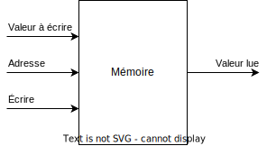

# Fonctionnement d'un processeur - étude du Classic RISC Pipeline

Bonjour 'nal,

Aujourd'hui, petit billet sur le fonctionnement des [processeurs](https://fr.wikipedia.org/wiki/Processeur). Nous allons voir par quelle magie le processeur arrive à comprendre et exécuter nos [programmes](https://fr.wikipedia.org/wiki/Programme_informatique). Pour cela, nous allons étudier le [Classic RISC Pipeline](https://en.wikipedia.org/wiki/Classic_RISC_pipeline), une [architecture](https://fr.wikipedia.org/wiki/Architecture_de_processeur) notamment implémentée par les processeurs [MIPS](https://fr.wikipedia.org/wiki/Architecture_MIPS) ou [SPARC](https://fr.wikipedia.org/wiki/Architecture_SPARC).

## L'ordinateur

Il existe toute sorte d'[ordinateurs](https://fr.wikipedia.org/wiki/Ordinateur). Des [grands](https://fr.wikipedia.org/wiki/Frontier_(superordinateur)), des [petits](https://fr.wikipedia.org/wiki/ESP32), des [transportables](https://fr.wikipedia.org/wiki/Ordinateur_portable), et même des [rouges](https://fr.wikipedia.org/wiki/IMac_G3) ([DA RED WUNZ GO FASTA!](https://tvtropes.org/pmwiki/pmwiki.php/Main/RedOnesGoFaster)). Mais comme ils fonctionnent tous selon les mêmes principes généraux, nous allons rester sur vision très abstraite. Nous allons nous contenter de dire que c'est un [système de traitement de l'information](https://fr.wikipedia.org/wiki/Syst%C3%A8me_de_traitement_de_l%27information) [programmable](https://fr.wikipedia.org/wiki/Programmation_informatique). En bref, c'est quelque chose capable de receuillir une information, lui appliquer un traitement pré-défini par l'utilisateur, et présenter le résultat.

# Fonctionnement d'un processeur - étude du Classic RISC Pipeline

Bonjour 'nal,

Aujourd'hui, petit billet sur le fonctionnement des [processeurs](https://fr.wikipedia.org/wiki/Processeur). Nous allons voir par quelle magie le processeur arrive à comprendre et exécuter nos [programmes](https://fr.wikipedia.org/wiki/Programme_informatique). Pour cela, nous allons étudier le [Classic RISC Pipeline](https://en.wikipedia.org/wiki/Classic_RISC_pipeline), une [architecture](https://fr.wikipedia.org/wiki/Architecture_de_processeur) notamment implémentée par les processeurs [MIPS](https://fr.wikipedia.org/wiki/Architecture_MIPS) ou [SPARC](https://fr.wikipedia.org/wiki/Architecture_SPARC).

## L'ordinateur

Il existe toute sorte d'[ordinateurs](https://fr.wikipedia.org/wiki/Ordinateur). Des [grands](https://fr.wikipedia.org/wiki/Frontier_(superordinateur)), des [petits](https://fr.wikipedia.org/wiki/ESP32), des [transportables](https://fr.wikipedia.org/wiki/Ordinateur_portable), et même des [rouges](https://fr.wikipedia.org/wiki/IMac_G3) ([DA RED WUNZ GO FASTA!](https://tvtropes.org/pmwiki/pmwiki.php/Main/RedOnesGoFaster)). 
Bien que tous différents, ils fonctionnent tous selons les mêmes principes généraux que nous allons abstraire. Nous allons nous contenter de dire que l'ordinateur est un [système de traitement de l'information](https://fr.wikipedia.org/wiki/Syst%C3%A8me_de_traitement_de_l%27information) [programmable](https://fr.wikipedia.org/wiki/Programmation_informatique). En bref, c'est quelque chose capable de receuillir une information, lui appliquer un traitement pré-défini par l'utilisateur, et présenter le résultat.

Pour réaliser ces traitements, l'ordinateur s'appuye sur deux composants : la mémoire et le processeur. La mémoire sert à stocker les données et le programme, le processeur exécute le programme et manipule les données.

Par la suite, nous ne chercherons pas à définir plus en détails les périphériques d'entrées et de sorties. Concernant la mémoire, nous nous contenterons de dire qu'on peut s'en servir pour y lire ou écrire une valeur à une adresse spécifiée.

Si `Écrire` est à l'était `vrai`, alors la `Valeur à écrire` sera écrite à l'adresse `Adresse`, sinon `Valeur lue` contiendra la valeur contenue à l'adresse `Adresse` 

## Le processeur
Pour réaliser ces traitements, l'ordinateur s'appuye sur deux composants : la mémoire et le processeur. La mémoire sert à stocker les données et le programme, le processeur exécute le programme et manipule les données.

Par la suite, nous ne chercherons pas à définir plus en détails les périphériques d'entrées et de sorties. Concernant la mémoire, nous nous contenterons de dire qu'on peut s'en servir pour y lire ou écrire une valeur à une adresse spécifiée.

Si `Écrire` est à l'était `vrai`, alors la `Valeur à écrire` sera écrite à l'adresse `Adresse`, sinon `Valeur lue` contiendra la valeur contenue à l'adresse `Adresse`.