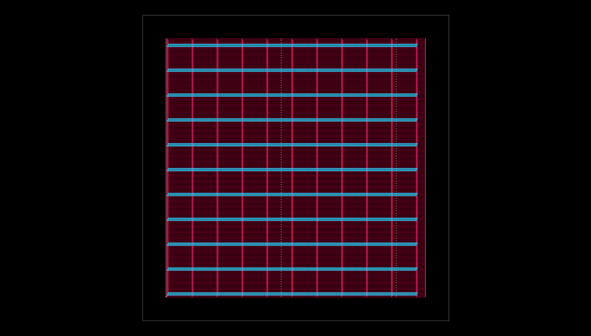
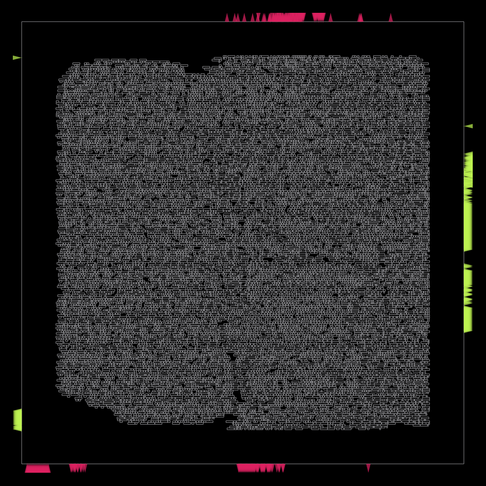
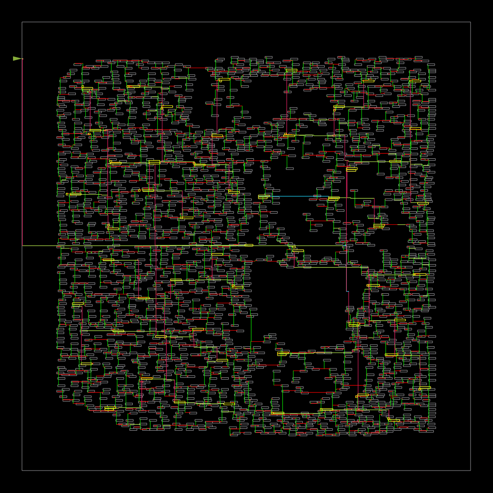
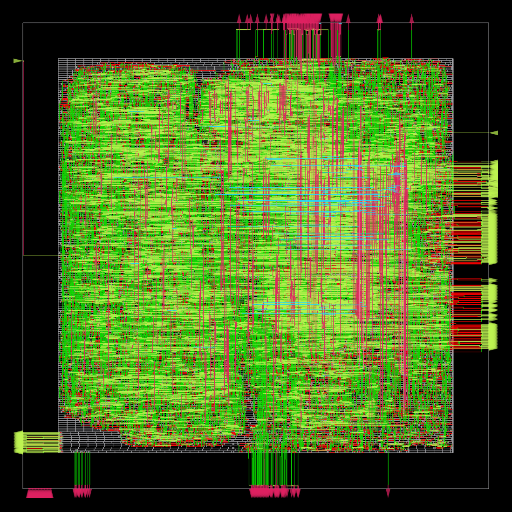
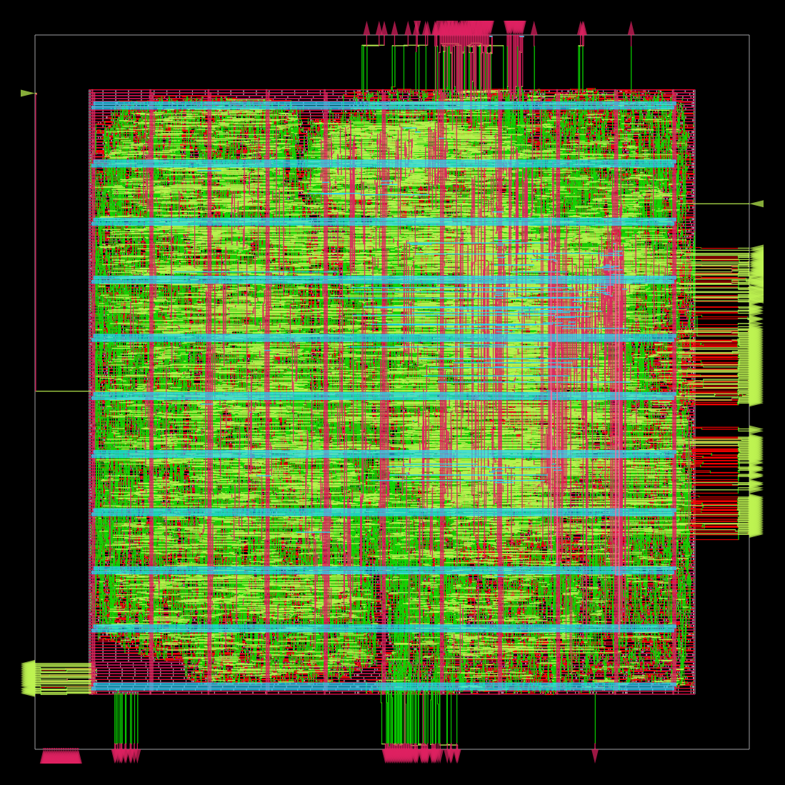

# Conception d’un circuit intégré avec OpenRoad

Bonjour, Nal !

Y'a quelques temps, je t'avais [expliqué comment faire un circuit integré avec QFlow](https://linuxfr.org/users/killruana/journaux/conception-d-un-circuit-integre-avec-qflow). Aujourd'hui, je vais te montrer comment faire la même chose avec OpenRoad.

Le [projet OpenRoad](https://theopenroadproject.org/) (“Foundations and Realization of Open, Accessible Design”) vise à simplifier la conception de circuits intégrés. Ils développent l'outil [OpenROAD](https://openroad.readthedocs.io/en/latest/) qui à partir d'une netlist s'occupe du P&R et cie pour générer un GDSII (voir journal précédent) ansi qu'un [flot RTL to GDSII complet](https://github.com/The-OpenROAD-Project/OpenROAD-flow-scripts).


## Installation de OpenRoad

ahahahahah. Souffre. [RTFM](https://openroad.readthedocs.io/en/latest/user/Build.html)

Mais globalement,

- Debian 11 / Ubuntu 20.04, 22.04: ils ont un dépôt, [RTFM](https://openroad-flow-scripts.readthedocs.io/en/latest/user/BuildWithPrebuilt.html)
- compilation via Docker: [RTFM](https://openroad-flow-scripts.readthedocs.io/en/latest/user/BuildWithDocker.html)
- compilation depuis les sources: [RTFM](https://openroad-flow-scripts.readthedocs.io/en/latest/user/BuildLocally.html)
- [nix](https://fr.wikipedia.org/wiki/Nix_(gestionnaire_de_paquets)) flake. Cadeau, mon `flake.nix` :
```nix
{
  inputs = {
    nixpkgs.url = "github:NixOS/nixpkgs/nixos-25.05";
    openroad = {
      type = "git";
      url = "https://github.com/The-OpenROAD-Project/OpenROAD";
      submodules = true;
    };
    yosys = {
      type = "git";
      url = "https://github.com/The-OpenROAD-Project/yosys";
      submodules = true;
    };
    flake-utils.url = "github:numtide/flake-utils";
  };

  outputs =
    {
      self,
      nixpkgs,
      flake-utils,
      openroad,
      yosys,
      ...
    }:
    flake-utils.lib.eachDefaultSystem (
      system:
      let
        pkgs = import nixpkgs {
          inherit system;
        };
      in
      {
        devShells.default = pkgs.mkShell {
          buildInputs = [
            openroad.packages.${system}.default
            yosys.packages.${system}.default
          ];
          packages = with pkgs; [
            fish
            nil
            nixd
            nixfmt-rfc-style
            time
            klayout
            verilator
            perl
            python3
            python3Packages.pandas
            python3Packages.numpy
            python3Packages.firebase-admin
            python3Packages.click
            python3Packages.pyyaml
            python3Packages.yamlfix
          ];
          shellHook = ''
            exec ${pkgs.fish}/bin/fish
          '';
        };
      }
    );
}
```

J'ai préféré passé par nix parce que `nix develop` et pouf j'ai un shell avec un tous les outils nécessaires sans avoir à créer un AUR pour Arch (I use Arch, btw) ou configurer docker pour rendre accessible le projet au containeur contenant les outils.

Enfin bref, normalement maintenant tu dois avoir accès à `openroad` :

```shell
$ openroad 
OpenROAD GITDIR-NOTFOUND 
Features included (+) or not (-): +GPU +GUI +Python
This program is licensed under the BSD-3 license. See the LICENSE file for details.
Components of this program may be licensed under more restrictive licenses which must be honored.
openroad>
```

## Installation de Openroad Flow

Maintenant, on récupère le dépôt du flot :

```shell
$ git clone https://github.com/The-OpenROAD-Project/OpenROAD-flow-scripts.git openroad-flow-scripts
```

## Le design : un processeur PicoRV32

Cette fois-ci, plutôt que de faire un Adder, on va faire un processeur RISC-V, le [PicoRV32](https://github.com/YosysHQ/picorv32).

> PicoRV32 is a CPU core that implements the RISC-V RV32IMC Instruction Set. It can be configured as RV32E, RV32I, RV32IC, RV32IM, or RV32IMC core, and optionally contains a built-in interrupt controller.

```shell
$ git clone https://github.com/YosysHQ/picorv32.git picorv32
```

## Configuration du flot

Normalement, on est censé mettre son design dans `openroad-flow-scripts/flow/designs/src/mondesign/` et la configuration dans `openroad-flow-scripts/flow/designs/<techno>/mondesign/`, puis faire un coup de `cd openroad-flow-scripts/flow/; make DESIGN_CONFIG=designs/<techno>/mondesign/config.mk` pour faire des chocapics.

Mais je trouve ça assez bof de bosser dans le dépot git d'un autre projet. Du coup on va foutre notre bazar ailleurs

### Création du design

On va pas s'embêter et on crée juste l'arborescence attendue par le flot et on symlink les sources du processeur.

```shell
$ mkdir -p designs/src/picorv32
$ ln -s ../../../picorv32/picorv32.v designs/src/picorv32/
```

#### Configuration pour implémenter le design avec la techno ASAP7

ASAP7 est une bibliothèque de cellules standard opensource pour la technologie de fabrication de circuits intégrés en 7 nm.

Création de la configuration du design:

```shell
$ mkdir -p designs/asap7/picorv32
$ nvim designs/asap7/picorv32/config.mk
$ nvim designs/asap7/picorv32/constraint.sdc
```

##### Config.mk

La configuration du flot se fait par des variables d'environnement défini dans un Makefile.

[RTFM](https://openroad-flow-scripts.readthedocs.io/en/latest/user/FlowVariables.html) pour la liste des variables disponibles.

```makefile
# Nom du design
export DESIGN_NAME = picorv32

# Nom de la plateforme technologique de destination
export PLATFORM    = asap7

# Fichiers sources
export VERILOG_FILES = $(DESIGN_HOME)/src/$(DESIGN_NICKNAME)/$(DESIGN_NAME).v

# Fichier de contraintes temporelles
export SDC_FILE      = $(DESIGN_HOME)/$(PLATFORM)/$(DESIGN_NICKNAME)/constraint.sdc

# Densité du circuit. (100 = pas d'espace libre)
# Réduire la valeur pour simplifier le placement et le routage.
# Augmenter la valeur pour réduire la taille du circuit.
export CORE_UTILIZATION       = 70

# Forme du circuit. 1 pour carré
export CORE_ASPECT_RATIO      = 1

# Taille des marges
export CORE_MARGIN            = 5

# Compacité du placement (1.0 un seul blob de cellules)
# Réduire la valeur pour disperser les cellules et améliorer le routage
# Augmenter la valeur pour regrouper les cellules et avoir de meilleures performances (In'ch Allah).
export PLACE_DENSITY          = 0.7

# Configuration du CPU
# RTFM https://github.com/YosysHQ/picorv32?tab=readme-ov-file#verilog-module-parameters
export VERILOG_TOP_PARAMS = \
	BARREL_SHIFTER 1 \
	COMPRESSED_ISA 1 \
	ENABLE_MUL 1 \
	ENABLE_DIV 1 \
  ENABLE_IRQ 1
```

##### Constraint.sdc

On crée un fichier de contraintes temporelles afin de s'assurer que le design respecte les contraintes de temporelles (si si, je vous jure). Aka, si je donne une horloge de 1GHz à mon processeur, est-ce que tous les signaux internes du processeur arrivent à destination à temps ?

```tcl
current_design riscv_top

set clk_name clk
set clk_port_name clk
set clk_period 1000
set clk_io_pct 0.125

set clk_port [get_ports $clk_port_name]

create_clock -name $clk_name -period $clk_period $clk_port

set non_clock_inputs [all_inputs -no_clocks]
set_input_delay [expr $clk_period * $clk_io_pct] -clock $clk_name $non_clock_inputs
set_output_delay [expr $clk_period * $clk_io_pct] -clock $clk_name [all_outputs]
```

### Bref

Normalement, là, votre dossier ressemble à ça :

```shell
$ tree
├── designs
│   ├── asap7
│   │   └── picorv32
│   │       ├── config.mk
│   │       └── constraint.sdc
│   └── src
│       └── picorv32
│           └── picorv32.v -> ../../../picorv32/picorv32.v
├── openroad-flow-scripts
└── picorv32
```

## Exécution du flot

```shell
$ export DESIGN_HOME=$PWD/designs
$ export WORK_HOME=$PWD/work
$ make -C openroad-flow-scripts/flow DESIGN_CONFIG=$DESIGN_HOME/asap7/picorv32/config.mk
```

Maintenant vous pouvez allez vous faire un café. Vous avez probablement le temps de passer au torréfacteur prendre du café vert, rentrer chez vous, le torréfier au four, le moudre, puis préparer un espresso pendant que le flot s'exécute.

Dans le dossier `work`, vous devriez voir les résultats de l'exécution du flot, notamment :

- `work/logs/asap7/picorv32/base/` : les journaux de l'exécution du flot
- `work/reports/asap7/picorv32/base/` : les rapports sur notre design
- `work/results/asap7/picorv32/base/` : les résultats de l'exécution du flot

### Synthèse logique

Nous avons un beau bébé de presque 19k portes logiques et d'une surface combinée de 2225 chaipasquoi² (μm² ?)

```
=== picorv32 ===
Number of wires:              18804
Number of wire bits:          19186
Number of public wires:         282
Number of public wire bits:     664
Number of ports:                 27
Number of port bits:            409
Number of memories:               0
Number of memory bits:            0
Number of processes:              0
Number of cells:              18718
  AND2x2_ASAP7_75t_R            489
  AND3x1_ASAP7_75t_R            668
  AND4x1_ASAP7_75t_R            172
  AND5x1_ASAP7_75t_R             56
  AO211x2_ASAP7_75t_R             9
  AO21x1_ASAP7_75t_R           1767
  AO221x1_ASAP7_75t_R           211
  AO222x2_ASAP7_75t_R            32
  AO22x1_ASAP7_75t_R             91
  AO31x2_ASAP7_75t_R              6
  AO32x1_ASAP7_75t_R            163
  AO33x2_ASAP7_75t_R              2
  AOI211x1_ASAP7_75t_R           45
  AOI21x1_ASAP7_75t_R           187
  AOI221x1_ASAP7_75t_R           12
  AOI22x1_ASAP7_75t_R            13
  BUFx2_ASAP7_75t_R            1706
  BUFx3_ASAP7_75t_R               4
  DFFHQNx1_ASAP7_75t_R         2382
  FAx1_ASAP7_75t_R               39
  HAxp5_ASAP7_75t_R             327
  INVx1_ASAP7_75t_R            1669
  NAND2x1_ASAP7_75t_R          2107
  NAND3x1_ASAP7_75t_R            17
  NOR2x1_ASAP7_75t_R            436
  NOR3x1_ASAP7_75t_R              9
  OA211x2_ASAP7_75t_R          1668
  OA21x2_ASAP7_75t_R           1990
  OA222x2_ASAP7_75t_R            75
  OA22x2_ASAP7_75t_R             48
  OA31x2_ASAP7_75t_R             19
  OA33x2_ASAP7_75t_R              5
  OAI21x1_ASAP7_75t_R           292
  OAI22x1_ASAP7_75t_R           119
  OR2x2_ASAP7_75t_R             249
  OR3x1_ASAP7_75t_R            1058
  OR4x1_ASAP7_75t_R             135
  OR5x1_ASAP7_75t_R              52
  TIELOx1_ASAP7_75t_R             1
  XNOR2x2_ASAP7_75t_R           190
  XOR2x2_ASAP7_75t_R            198

Chip area for module '\picorv32': 2225.345400
```

### Floorplan

Le floorplan de notre design. On peut voir la powergrid au centre du die.



### Placement

Les portes logiques placés sur le die. On peut voir que le placement des IO en bordure du die est un peu caca. Cela mériterai de faire un script qui place manuellement les IO.



### Arbre d'horloge

L'arbre d'horloge de notre design. L'arbre d'horloge est responsable de la distribution du signal d'horloge à toutes les portes logiques afin d'assurer la bonne synchronisation de notre circuit.



### Routage

Le routage de notre design. Le routage est responsable de la connexion des portes logiques entre elles et de la distribution des signaux à travers le circuit.



### Résultat

Bon ben voila, notre picorv32, prêt à être envoyé chez un fondeur pour fabrication :



## Conclusion

OpenRoad, c'est cool, ça permet d'avoir rapidement et facilement un truc qui fonctionne. À partir de là, y'a plus qu'à itérer pour améliorer la config et optimiser le design.